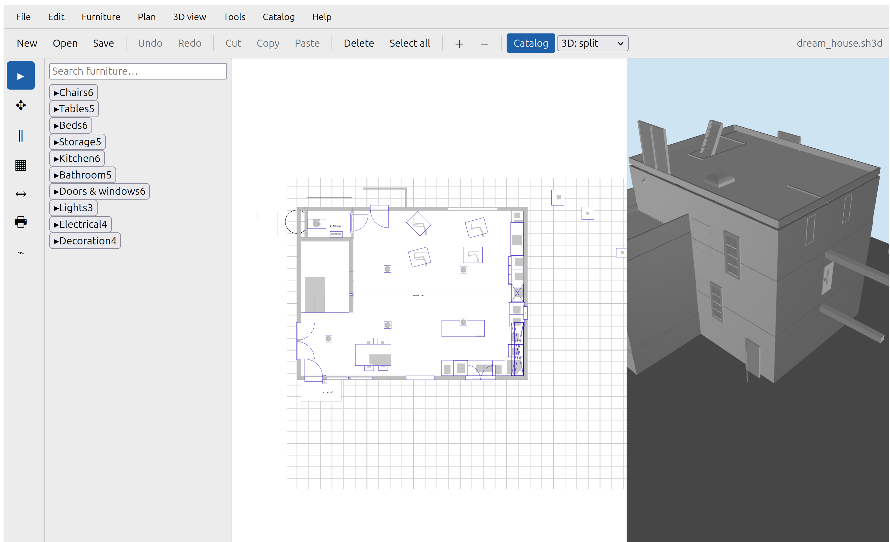

# SweetHomeJS

A browser port of [Sweet Home 3D](https://sweethome3d.com) 7.5 to
TypeScript/JavaScript — plan your home in 2D, view it in 3D, render photos,
export PDF/CSV, and print — all in the browser, GPL v2+.



## Features

- **2D plan**: draw walls (with 15° magnetism and vertex snapping), rooms
  (manual + bucket-fill), dimensions, labels, polylines; select/move/align;
  zoom & pan; grid/rulers.
- **3D view**: full Three.js scene (walls, rooms, furniture, lights, sun,
  shadows), observer/top cameras, store & go-to camera.
- **Files**: open/save `.sh3d` (including legacy serialized homes), drag &
  drop, File System Access; recent homes in IndexedDB.
- **Photo/video**: Three.js photo renderer (progressive passes), video frames
  along a camera path, WebM recording.
- **Export/print**: SVG, vector PDF, CSV (Java-compatible), browser print
  preview at paper sizes, PWA offline shell.
- **i18n**: 8 locales (en/fr/de/es/it/pt/nl/ru), built-in help.

## Running

```bash
npm install
npm run dev          # http://localhost:5199
npm run build        # production build in apps/web/dist
npm run preview      # serve the production build
```

Load a home via **File ▸ Open…** (pick a `.sh3d`) or `?file=/fixtures/…`.

## Development

```bash
npm test             # unit tests (vitest, all packages)
npm run test:boundaries
npm run typecheck
npx eslint .
npx playwright test  # e2e (boots its own dev server on :5199)
npm run build
```

Docs: `docs/` (architecture, file format, porting strategy, photo/video,
worker topology, …). The Java sources are the parity oracle (see
`tools/java-harness`).

## Support matrix

| Browser | Plan 2D | 3D view | Photos | Videos | File picker | Offline (PWA) |
| --- | --- | --- | --- | --- | --- | --- |
| Chrome / Edge (desktop) | ✅ | ✅ | ✅ | ✅ | ✅ (FSA) | ✅ |
| Firefox (desktop) | ✅ | ✅ | ✅ | ✅ | ⚠️ (download) | ✅ |
| Safari (desktop) | ✅ | ✅ | ✅ | ⚠️ | ⚠️ (download) | ⚠️ |
| Mobile (iOS/Android) | ✅ | ⚠️ (WebGL) | ⚠️ | — | ⚠️ | ⚠️ |

- **File picker**: File System Access (Chromium) with `<input type=file>`
  fallback (Firefox/Safari); saving falls back to downloads.
- **3D/photos**: WebGL2/WebGL1 required; `isAvailable()` probes gracefully.
- **Videos**: WebM via MediaRecorder (Chromium/Firefox); Safari has partial
  MediaRecorder support.
- **PWA**: service worker registers in production builds (Chrome/Edge/Firefox).

## License

GPL v2 or later — a translation of Sweet Home 3D's GPL'd source. Every
translated file carries the license header (see `templates/`, applied by
`tools/apply-license-headers.mjs`).
